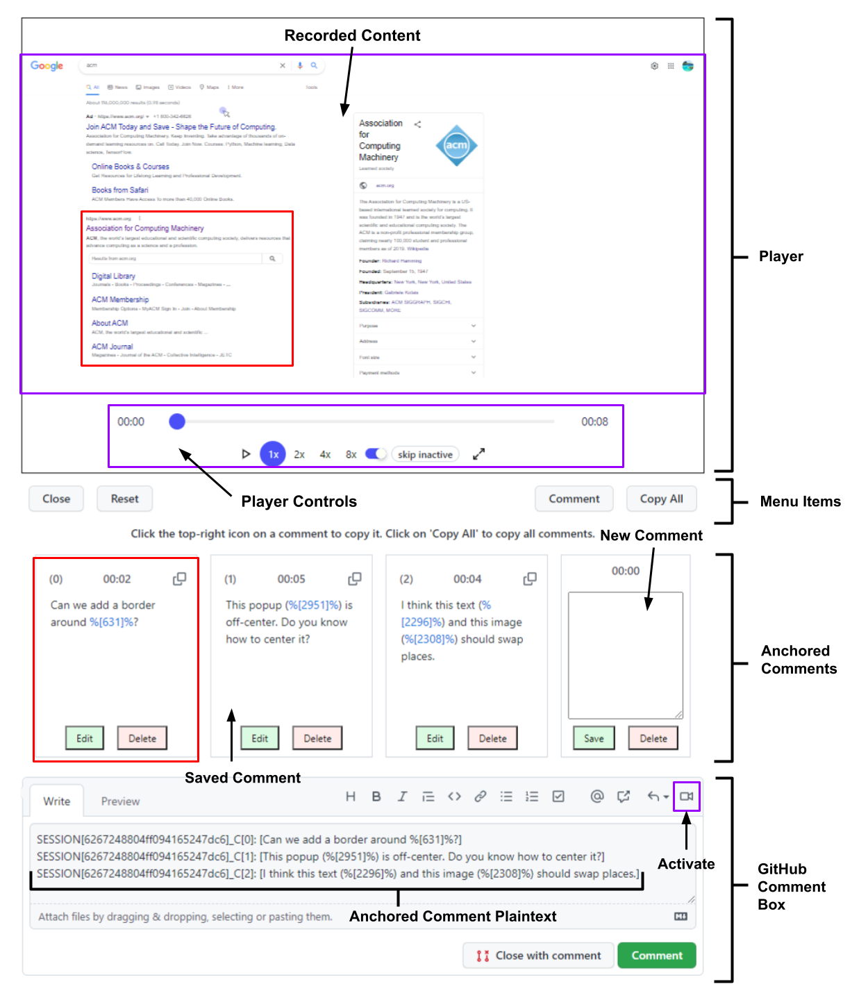

# 🖥️ ReferencesPlus

### **Overview**
This project aims to enhance the GitHub PR Discussion experience by embedding web interactions into the pull request discussion and allowing reviewers to make precise references to visual elements and dynamic changes. The tool is currently in the very early stages of development and needs a lot of improvement before it is ready to be implemented on a large scale.

There is room to extend this project by adding more features as well, such as code references, indirect references, and greater support for platform-specific items.

### **Backend Server**

**[Information and Setup Guide](backend-server/guide.md)**

### **Chrome Extension**

**[Information and Setup Guide](chrome-extension/guide.md)**